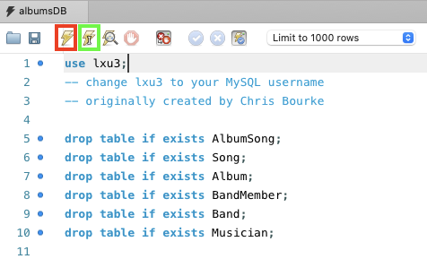

# Computer Science II
## Lab 7 - MySQL Query 

An introduction to MySQL used in databases.

This is a lab used in Computer Science II (CSCE 156) for Fall 2025 
in the [School of Computing](https://computing.unl.edu) 
at the [University of Nebraska-Lincoln](https://www.unl.edu).

## Overview

### Resources

-   Examples of MySQL Queries  
        <https://dev.mysql.com/doc/refman/8.0/en/examples.html>

-   MySQL Select Statement   
        <https://dev.mysql.com/doc/refman/8.0/en/select.html>

-   MySQL Aggregate Functions  
        <https://dev.mysql.com/doc/refman/8.0/en/aggregate-functions.html>

-   MySQL Group By Clause  
        <https://dev.mysql.com/doc/refman/8.0/en/group-by-modifiers.html>

### Lab Objectives & Topics

Following the lab, you should be able to:

-   perform basic database query operations
  
-   understand complex queries using aggregate functions and group by clauses

Note that the lab may involve some concepts or statements not covered (yet) in the class. You should be able to complete the lab without fully understanding them. If you have any questions about them, please feel free to ask our LAs. 


### Peer Programming Pair-Up

At the start of each lab, you may find a team member by yourself or be randomly paired up with another student by a lab instructor.  One of you will be designated the *driver* and the other the *navigator*. Each week you should try to alternate: if you were a driver last week, be a navigator next, etc. If you prefer to work on this lab by yourself, that is fine too.

***Note that each student must answer the lab questions on Canvas for grading.***

  
## 1. Connect to MySQL server on Linux server

Please connect to the MySQL server running on `nuros.unl.edu` of the School of Computing. Please refer to [Lab 5](https://github.com/lisongxu/CSCE156-Lab-DB-Install) for instructions on how to connect to the MySQL server.

## 2. The database

In this lab, we use a database with multiple tables about music albums, songs, and the artists involved. Below is the entity-relation diagram of these tables. 

<p align="center">

</p> 

  * Band: The Band table stores information about musical groups. Each record has a unique bandId as the primary key and a required name. Other tables—such as Album and BandMember—reference Band to indicate which group released an album or which group a musician belongs to.
  * Musician: The Musician table represents individual artists. Each musician has a unique musicianId as the primary key, along with optional firstName, lastName, and country fields. Because musicians are stored independently of bands, one musician may be associated with multiple groups over time.
  * BandMember: The BandMember table links musicians to bands and represents a many-to-many relationship between the two. It has a unique bandMemberId primary key, and includes foreign keys that reference both bandId and musicianId, as well as a joinedOn date. This design allows the database to track which musicians belong to which band and when they joined.
  * Album: The Album table stores information about music albums. Each album has a unique albumId primary key, a required title, year, and number, and a foreign key bandId indicating which band released it. This creates a one-to-many relationship where each band can release many albums.
  * Song: The Song table holds a catalog of song titles. Each song has a unique songId primary key and a required title. Songs are stored independently from albums so that the database can reuse song records or track songs outside of a specific release.
  * AlbumSong: The AlbumSong table connects songs to albums and captures track-specific details. It has a unique albumSongId primary key and includes trackNumber, trackLength (in seconds), and foreign keys for both albumId and songId. This structure allows the database to record the order and length of songs as they appear on a particular album.


## 3. Activities 

1. Download the provided MySQL file [`albumsDB.sql`](albumsDB.sql) to create all these tables. 

2. Below is the first statement of the MySQL file. Replace `lxu3` with your MySQL username. 

```sql
use lxu3;
```

3. Execute the modified MySQL code, which takes some time to create all the tables and insert all the data. There are two methods to execute the MySQL code in MySQLWorkbench.
   * Method 1: click the icon in the red box of the screenshot to execute the whole script or the selected portion
   * Method 2: click the icon in the green box to execute only the current statement, move the cursor to the next statement and click the icon again, ... 

<p align="center">

</p> 

4. Please write select statements to find the information asked in the lab questions on Canvas.

## 4. Answer the lab questions on Canvas

* You do not need to submit any MySQL code or any MySQL statements for this lab. Instead please answer the lab questions on Canvas. 
