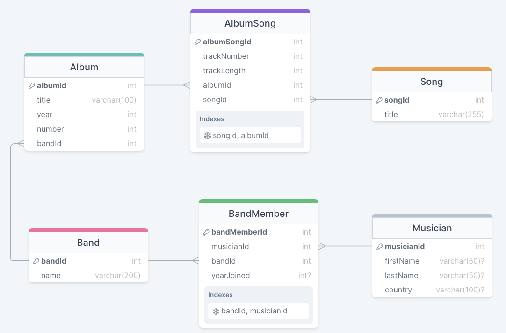

# Computer Science II
## Lab 7.0 - MySQL 

An introduction to MySQL used in databases.

This is a lab used in Computer Science II (CSCE 156) for Fall 2023 
in the [School of Computing](https://computing.unl.edu) 
at the [University of Nebraska-Lincoln](https://unl.edu).

## Overview

### Resources

-   Examples of MySQL Queries  
        <https://dev.mysql.com/doc/refman/8.0/en/examples.html>

-   MySQL Data Types  
        <https://dev.mysql.com/doc/refman/8.0/en/data-types.html>
    
-   MySQL Select Statement   
        <https://dev.mysql.com/doc/refman/8.0/en/select.html>
   
### Lab Objectives & Topics

Following the lab, you should be able to:

-   perform basic database query operations
  
-   understand complex queries using aggregate functions and group by clauses

Note that the lab may involve some concepts or statements not covered (yet) in the class. You should be able to complete the lab without fully understanding them. If you have any questions about them, please feel free to ask our LAs. 

### Peer Programming Pair-Up

At the start of
each lab, you may find a team member by yourself or may be randomly paired up with another student by
a lab instructor.  One of you will be designated the *driver* 
and the other the *navigator*. If you prefer to work on this lab by yourself, that is fine too.  Each week you should try to alternate: if you were a driver 
last week, be a navigator next, etc. 

***Note that, each student must answer the lab questions on Canvas for grading.***

  
## 1. Connect to MySQL server on Linux server

Please connect to the MySQL server running on `cse-linux-01.unl.edu` of School of Computing.

## 2. Activities 

### 2.1 Download the MySQL code

Download the provided MySQL file `albumQueries.sql`, which creates multiple tables about music albums, songs, and the artists involved. Below is the E-R diagram of these tables. 

 

### 2.2 Select your database

Replace `lxu3` in the first line of the code with your MySQL username. 

### 2.3 Execute the MySQL code

Execute the modified MySQL code

## 3. Answer the lab questions on Canvas

* You do not need to submit any code for this lab. Instead please answer the lab questions on Canvas. 
